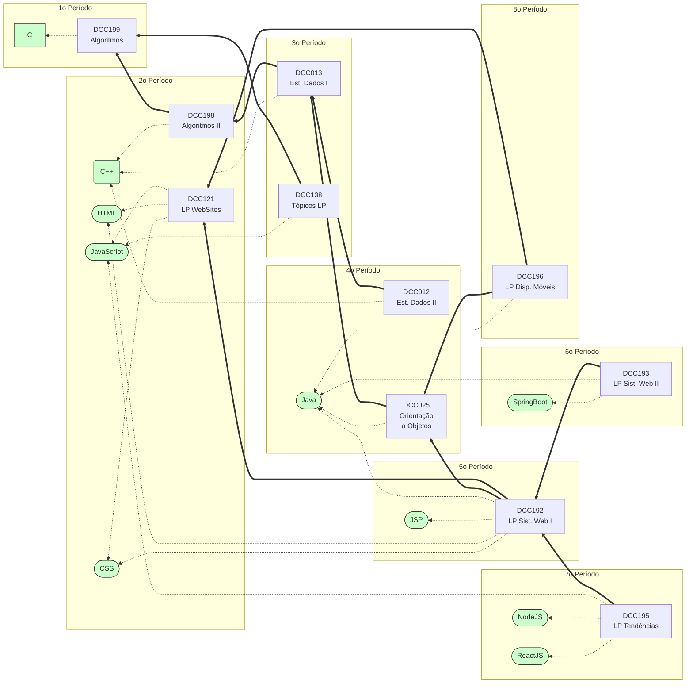

# Sistemas de Informação matriz 2016 (Como está)



# Sistemas de Informação matriz 202X (Sugestão 1: Marco Antônio)

```mermaid
flowchart RL
subgraph 1o Período
    DCC199[DCC199\nAlgoritmos]
    DCC199 -.-> Python([Python])
end

subgraph 2o Período
    DCC198[DCC198\nAlgoritmos II]
    DCC198 ==> DCC199
    DCC198 -.-> CPP(C++)

    DCC121[DCC121\nLP WebSites]
    DCC121 -.-> JS([JavaScript])
    DCC121 -.-> HTML([HTML])
    DCC121 -.-> CSS([CSS])
end

subgraph 3o Período
    DCC013[DCC013\nEst. Dados I]
    DCC013 ==> DCC198
    DCC013 -.-> CPP

    DCC138[DCC138\nTópicos LP]
    DCC138 ==> DCC199
    DCC138 -.-> JS
end

subgraph 4o Período
    DCC012[DCC012\nEst. Dados II]
    DCC012 ==> DCC013
    DCC012 -.-> CPP

    DCC025[DCC025\nOrientação\na Objetos]
    DCC025 ==> DCC013
    DCC025 -.-> Python
end

subgraph 5o Período
    DCC192[DCC192\nLP Sist. Web I\n(Backend)]
    DCC192 ==> DCC121
    DCC192 ==> DCC025
    DCC192 -.-> SpringBoot([SpringBoot])
    DCC192 -.-> JavaScript
    DCC192 -.-> CSS
    DCC192 -.-> HTML
end

subgraph 6o Período
    DCC193[DCC193\nLP Sist. Web II\n(Frontend)]
    DCC193 ==> DCC121
    DCC193 ==> DCC025
    DCC193 -.-> NodeJS([NodeJS])
    DCC193 -.-> ReactJS([ReactJS])
end

subgraph 7o Período
DCC195[DCC195\nLP Tendências]
    DCC195 ==> DCC192
    DCC195 ==> DCC193
    DCC195 -.-> Outra
end

subgraph 8o Período
    DCC196[DCC196\nLP Disp. Móveis]
    DCC196 ==> DCC193
    DCC196 -.-> ReactNative([ReactNative])
end


    classDef tech fill:#cfc,stroke:#333,stroke-width:1px
    class Python,Outra,ReactNative,C,CPP,HTML,CSS,JS,NodeJS,Java,JSP,SpringBoot,ReactJS tech;
```
